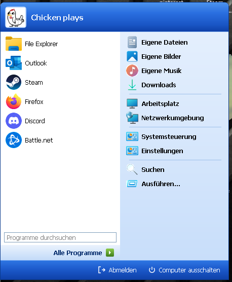
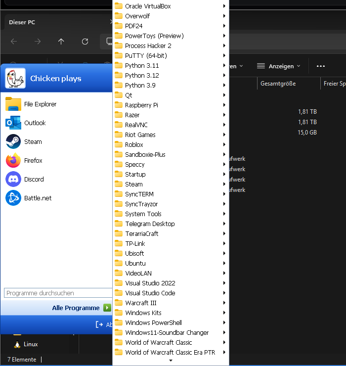

# retro-menu-win11

Ein Startmenü im Windows-XP-Stil für Windows 11 – das Gegenstück zu
[RetroBar](https://github.com/dremin/RetroBar), das dasselbe mit der Taskleiste macht.

RetroBar ersetzt die Taskleiste, lässt aber das moderne Windows-11-Startmenü stehen.
Genau diese Lücke schließt dieses Projekt: Die Windows-Taste (und der Start-Knopf von
RetroBar) öffnen ab jetzt ein klassisches zweispaltiges Menü statt der Kacheloberfläche.



## Was drin ist

* **Klassisches XP-Layout** – blauer Kopf mit Benutzerbild und -name, links angeheftete
  und häufig verwendete Programme, rechts die Ordner und Systemorte, unten
  „Abmelden" und „Computer ausschalten".
* **„Alle Programme"** als aufklappendes Kaskadenmenü, direkt aus den beiden
  Startmenü-Ordnern (System + Benutzer) zusammengeführt, mit echten Programmsymbolen.
* **Store-Apps** werden mitgelistet – die haben keine Verknüpfung auf der Platte und
  tauchen in den klassischen Ordnern deshalb nie auf.
* **Suchfeld** über alle gefundenen Programme, Enter startet den ersten Treffer.
* **Anheften und Verlauf**: Rechtsklick auf einen Eintrag zum Anheften, Lösen, als
  Administrator starten oder Dateipfad öffnen. Die Liste „häufig verwendet" füllt sich
  selbst, genau wie früher.
* **Themes**, die zu RetroBar passen – und auf Wunsch automatisch dessen Design
  übernehmen.
* **Ein Startknopf, zwei Wege**: Windows-Taste oder der Start-Knopf von RetroBar.



## Installation

Gebraucht wird das **.NET 8 Desktop Runtime** (oder das SDK zum Selberbauen).

```bash
git clone https://github.com/glappa/retro-menu-win11.git
```

Bauen und starten:

```bash
dotnet build src/RetroMenu/RetroMenu.csproj -c Release
```

Eine einzelne EXE zum Weitergeben:

```bash
powershell -ExecutionPolicy Bypass -File publish.ps1
```

Das Ergebnis liegt danach in `publish/RetroMenu.exe`. Zum automatischen Start bei
jeder Anmeldung genügt der Haken **„Mit Windows starten"** in den Einstellungen.

## Bedienung

| Aktion | Wirkung |
| --- | --- |
| Windows-Taste | Menü auf/zu |
| Start-Knopf in RetroBar | Menü auf/zu |
| Klick auf das Tray-Symbol | Menü auf |
| Rechtsklick aufs Tray-Symbol | Einstellungen, Programmliste neu einlesen, Beenden |
| Esc | Menü zu |
| Tippen | sucht in allen Programmen |
| Rechtsklick auf einen Eintrag | Anheften, Lösen, als Administrator starten, Dateipfad |

Alle Kombinationen mit der Windows-Taste (Win+E, Win+R, Win+D, Win+L …) funktionieren
unverändert weiter.

## Wie das Abfangen der Windows-Taste funktioniert

Windows öffnet sein Startmenü beim **Loslassen** der Windows-Taste – aber nur, wenn
zwischendurch keine andere Taste gedrückt wurde. Das Programm hängt sich mit einem
`WH_KEYBOARD_LL`-Hook in den Tastaturstrom und schiebt bei einem einzelnen Tippen kurz
vor dem Loslassen eine unbelegte Taste ein. Für Windows sieht das wie eine
Tastenkombination aus, sein eigenes Menü bleibt zu – und wir zeigen unseres.

Weil ein solcher Hook auch simulierte Eingaben sieht, funktioniert der Start-Knopf von
RetroBar ohne jede Anpassung mit: RetroBar ruft dafür `ShellHelper.ShowStartMenu()` aus
ManagedShell auf, und das simuliert genau so einen einzelnen Windows-Tastendruck.

Falls das auf einem Rechner nicht greift, gibt es in den Einstellungen zwei Alternativen:

| Modus | Verhalten |
| --- | --- |
| **Abfangen** (Standard) | Windows-Taste läuft durch, wird nur neutralisiert |
| **Vollständig schlucken** | Taste wird abgefangen und nur bei echten Kombinationen wieder eingespeist |
| **Nicht anfassen** | Hook aus; das Menü geht dann nur über Tray-Symbol und RetroBar |

## Themes

| Theme hier | RetroBar-Designs, die darauf abgebildet werden |
| --- | --- |
| Windows XP Blue | Windows XP Blue, XP Embedded Style, Vista Basic, System XP/Vista |
| Windows XP Olive Green | Windows XP Olive Green |
| Windows XP Silver | Windows XP Silver |
| Windows XP Royale | XP Royale, Royale Noir, Zune Style, Watercolor, Longhorn/Vista Aero |
| Classic Grey | Windows 95-98, Windows 2000, Windows Me, XP Classic, Vista Classic, System |

Ist **„Design von RetroBar übernehmen"** aktiv (Standard), liest das Menü RetroBars
`settings.json` mit und wechselt das Design automatisch mit, sobald dort eines
umgestellt wird. Geschrieben wird in RetroBars Dateien nie.

Übernommen wird von dort außerdem die Sprache, die Kantenglättung der Schrift und –
einmalig beim ersten Start – die Quick-Launch-Reihenfolge als Startbelegung der
angehefteten Programme.

## Einstellungen

Alles liegt in `%AppData%\RetroMenuWin11\settings.json`:

| Schlüssel | Bedeutung |
| --- | --- |
| `Theme`, `FollowRetroBarTheme` | Design, bzw. RetroBar folgen |
| `Language` | `auto`, `de` oder `en` |
| `WinKeyMode` | `Neutralize`, `Swallow` oder `Off` |
| `FrequentCount` | Wie viele „häufig verwendet"-Einträge |
| `ShowSearchBox`, `ShowStoreApps`, `ShowRunAsAdmin` | Ein/aus |
| `Pinned`, `LaunchCounts` | Angeheftetes und Startzähler |
| `UserName` | Überschreibt den angezeigten Namen |

Daneben liegt `retromenu.log`. Mit gesetzter Umgebungsvariable `RETROMENU_DEBUG=1`
protokolliert das Programm zusätzlich jedes Ereignis der Windows-Taste – hilfreich,
wenn der Hook auf einem Rechner nicht so will.

## Bekannte Grenzen

* Über Fenstern, die **als Administrator** laufen, sieht ein normaler Tastatur-Hook
  nichts. Wer das Menü auch dort per Windows-Taste braucht, muss RetroMenu selbst
  erhöht starten.
* Windows 11 liefert für „Arbeitsplatz" und „Netzwerkumgebung" über alle Icon-APIs nur
  ein Standard-Ordnersymbol. Diese beiden Symbole werden deshalb direkt aus
  `imageres.dll` geholt.
* Die Kaskade zeigt die Startmenü-Ordner so, wie sie auf der Platte liegen – Programme
  ohne Verknüpfung erscheinen nur unter „Store-Apps" und in der Suche.
* Mehrere Monitore werden unterstützt; das Menü erscheint an der Leiste des Monitors,
  auf dem der Mauszeiger steht.

## Fahrplan

* Ein echtes 9x-Layout (einspaltig, mit senkrechtem Banner) für das graue Theme
* Scrollleisten im XP-Stil statt der WPF-Standardleisten
* Tastaturnavigation in den Spalten (aktuell nur Suche und Kaskade)
* Weitere Sprachen

## Danke

An [dremin](https://github.com/dremin) für RetroBar und ManagedShell – ohne die
Vorarbeit gäbe es hier nichts anzuschließen.

## Lizenz

MIT, siehe [LICENSE](LICENSE).

---

### English, briefly

An XP-style Start menu for Windows 11, built as the companion piece to
[RetroBar](https://github.com/dremin/RetroBar): RetroBar replaces the taskbar, this
replaces the Start menu it leaves behind. A low-level keyboard hook turns a lone
Windows-key press into the classic two-column menu while every Win+X shortcut keeps
working, and because such a hook also sees simulated input, RetroBar's own Start button
opens it too without any patching. Themes mirror RetroBar's and can follow its setting
automatically. Requires the .NET 8 Desktop Runtime; build with
`dotnet build src/RetroMenu/RetroMenu.csproj -c Release`.
