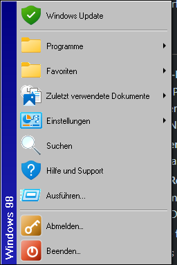
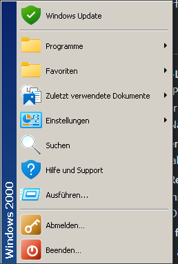

# retro-menu-win11

Ein Startmenü im Stil älterer Windows-Versionen für Windows 11 – das Gegenstück zu
[RetroBar](https://github.com/dremin/RetroBar), das dasselbe mit der Taskleiste macht.

RetroBar ersetzt die Taskleiste, lässt aber das moderne Windows-11-Startmenü stehen.
Genau diese Lücke schließt dieses Projekt: Die Windows-Taste (und der Start-Knopf von
RetroBar) öffnen ab jetzt ein klassisches Menü statt der Kacheloberfläche.


## Installation

Die fertigen Dateien liegen unter [Releases](https://github.com/glappa/retro-menu-win11/releases).

| Datei | Für wen |
| --- | --- |
| `RetroMenu-Setup-x64.exe` | Der übliche Weg. Bringt alles mit, setzt nichts voraus. |
| `RetroMenu-portable-x64.zip` | Wer nichts installieren möchte. Braucht das [.NET 8 Desktop Runtime](https://dotnet.microsoft.com/download/dotnet/8.0). |

Zu jeder Ausgabe stehen die **SHA-256-Prüfsummen** in den Anmerkungen und in
`SHA256SUMS.txt`. Nachrechnen lässt sich das mit:

```bash
powershell -Command "Get-FileHash .\RetroMenu-Setup-x64.exe -Algorithm SHA256"
```

Der Assistent legt das Programm in **Ihren eigenen Benutzerordner**
(`%LocalAppData%\Programs\RetroMenu`). Keine Administratorrechte, keine Änderung am
System. Auf Wunsch richtet er **RetroBar gleich mit ein** – geladen wird dabei das
Portable-Archiv direkt von dessen Releases, und die Prüfsumme des Downloads steht
anschließend im Protokoll des Assistenten. Entfernen geht über die Programmliste von
Windows.

Selber bauen:

```bash
dotnet build src/RetroMenu/RetroMenu.csproj -c Release
```

```bash
powershell -ExecutionPolicy Bypass -File release.ps1
```

## Zwei Menüs, je nach Epoche

Das Startmenü hat sich zwischen Windows Me und Windows XP grundlegend geändert, und
beide Formen sind hier nachgebaut – nicht nur andere Farben, sondern der jeweils
richtige Aufbau.

| | |
| --- | --- |
|  |  |

**Eine Spalte mit senkrechtem Banner** (Windows 95, 98, Me, 2000): Windows Update,
Programme ▸, Favoriten ▸, Zuletzt verwendete Dokumente ▸, Einstellungen ▸, Suchen,
Hilfe, Ausführen…, dann Abmelden… und Beenden… Der Streifen am linken Rand trägt den
Versionsnamen von unten nach oben.

**Zwei Spalten mit Kopf und Fuß** (Windows XP in vier Farben): links die beiden
Sonderplätze „Internet" und „E-Mail" samt Standardprogramm, darunter Angeheftetes und
häufig Verwendetes, rechts die Systemorte, unten Abmelden und Ausschalten.

## Was drin ist

* **Nachgemessene Maße statt Nachempfinden.** Für XP: 384 Pixel breit, zwei Spalten zu
  je 190, Kopf 54, Fuß 36, Zeilen 34 bzw. 26, Tahoma 11 – dazu die dreizehn Farbstufen
  des Kopf-Verlaufs, die orange Haarlinie darunter und die flache Auswahlfarbe
  `#2F71CD`. Für die 9x-Familie das 3D-System­grau der Zeit und ein Banner in vollem
  `#000080`, abgenommen von der Originalgrafik.
* **Systemweite Suche im Stil der Windows-11-Suche**: gruppiert in *Beste
  Übereinstimmung / Apps / Einstellungen / Dateien*. Sie findet alle Programme des
  Rechners (App-Paths-Registry, Uninstall-Einträge, Installationsordner), die
  Windows-Einstellungen und – per Häkchen – Dateien über den Windows-Suchindex.
  Anfangsbuchstaben zählen mit, „vsc" findet also Visual Studio Code.
* **Das echte Explorer-Kontextmenü** auf jedem Eintrag – Öffnen, Als Administrator
  ausführen, Senden an ▸, Ausschneiden, Kopieren, Löschen, Eigenschaften und alles,
  was Shell-Erweiterungen beisteuern, nur eben im Retro-Anstrich.
* **„Alle Programme"** als Kaskade aus den beiden Startmenü-Ordnern zusammengeführt,
  dazu Store-Apps, die keine Verknüpfung auf der Platte haben.
* **Favoriten mit Ordnern.** Rechtsklick auf einen Eintrag legt ihn oben in die
  Favoritenliste. Von dort lässt er sich in einen Ordner verschieben – wie die
  Gruppen im Windows-11-Menü, nur klappt der Ordner hier als Kaskade auf statt als
  Kachelraster. Ordner lassen sich umbenennen und wieder auflösen.
* **Häufig oder zuletzt verwendet.** Die untere Liste zeigt wahlweise die am
  häufigsten oder die zuletzt gestarteten Programme (Einstellungen →
  „Zuletzt gestartete Programme zeigen"). Nach XP-Regeln bleiben Installer,
  Deinstallationsprogramme und Systemwerkzeuge draußen; ein Programm kann sich per
  `NoStartPage` heraushalten. Neu installierte Programme werden hervorgehoben.
* **Auto-Hide-Taskleiste fährt mit hoch**, solange das Menü offen ist.
* **Tastatur**: Pfeiltasten durch beide Spalten, Buchstaben springen, Eingabe startet.
* **Einstellungen** über das Tray-Symbol: Design, Größe, Sprache, Verhalten der
  Windows-Taste, Suchfeld, Autostart.

## Bedienung

| Aktion | Wirkung |
| --- | --- |
| Windows-Taste | Menü auf/zu |
| Start-Knopf in RetroBar | Menü auf/zu |
| Klick auf das Tray-Symbol | Menü auf |
| Rechtsklick aufs Tray-Symbol | Einstellungen, Programmliste neu einlesen, Beenden |
| Esc | Menü zu |
| Tippen | sucht in Programmen, Einstellungen und auf Wunsch Dateien |
| Rechtsklick auf einen Eintrag | Favoriten, Ordner und das volle Explorer-Menü |
| Zeigen auf einen Favoritenordner | klappt ihn auf |
| Umschalt + Rechtsklick | dazu die erweiterten Befehle |
| Zeigen auf ▸-Einträge | klappt das Untermenü auf |
| Pfeiltasten / Buchstaben / Eingabe | Bedienung ohne Maus |
| Klick auf das Benutzerbild | Benutzerkonten |

Alle Kombinationen mit der Windows-Taste (Win+E, Win+R, Win+D, Win+L …) funktionieren
unverändert weiter.

## Wie das Abfangen der Windows-Taste funktioniert

Windows öffnet sein Startmenü beim **Loslassen** der Windows-Taste – aber nur, wenn
zwischendurch keine andere Taste gedrückt wurde. Das Programm hängt sich mit einem
`WH_KEYBOARD_LL`-Hook in den Tastaturstrom und schiebt bei einem einzelnen Tippen kurz
vor dem Loslassen eine unbelegte Taste ein. Für Windows sieht das wie eine
Tastenkombination aus, sein eigenes Menü bleibt zu – und wir zeigen unseres.

Weil ein solcher Hook auch simulierte Eingaben sieht, funktioniert der Start-Knopf von
RetroBar ohne jede Anpassung mit: RetroBar ruft dafür `ShellHelper.ShowStartMenu()` aus
ManagedShell auf, und das simuliert genau so einen einzelnen Windows-Tastendruck.

Falls das auf einem Rechner nicht greift, gibt es in den Einstellungen zwei Alternativen:

| Modus | Verhalten |
| --- | --- |
| **Abfangen** (Standard) | Windows-Taste läuft durch, wird nur neutralisiert |
| **Vollständig schlucken** | Taste wird abgefangen und nur bei echten Kombinationen wieder eingespeist |
| **Nicht anfassen** | Hook aus; das Menü geht dann nur über Tray-Symbol und RetroBar |

## Die Taskleiste kommt mit hoch

Läuft RetroBar mit automatischem Ausblenden, fährt die Leiste beim Öffnen des Menüs
wieder heraus und bleibt stehen, bis das Menü zugeht.

Erreicht wird das ohne einen einzigen Eingriff in RetroBar: RetroBar sucht zehnmal
pro Sekunde nach einem offenen Startmenü und erkennt dabei neben dem modernen Menü
auch fremde — unter anderem an der Fensterklasse `OpenShell.CMenuContainer`. Solange
unser Menü offen ist, halten wir ein leeres, vollständig durchsichtiges und
klickdurchlässiges Fenster dieser Klasse über der Menüfläche.

## Designs

| Design | Aufbau | RetroBar-Designs, die darauf abgebildet werden |
| --- | --- | --- |
| Windows 95 | eine Spalte | – |
| Windows 98 | eine Spalte | Windows 95-98 |
| Windows Me | eine Spalte | Windows Me |
| Windows 2000 | eine Spalte | Windows 2000, XP Classic, Vista Classic, System |
| Windows XP Blue | zwei Spalten | XP Blue, XP Embedded Style, Vista Basic, System XP/Vista |
| Windows XP Olive Green | zwei Spalten | Windows XP Olive Green |
| Windows XP Silver | zwei Spalten | Windows XP Silver |
| Windows XP Royale | zwei Spalten | XP Royale, Royale Noir, Zune Style, Watercolor, Longhorn/Vista Aero |

Ist **„Design von RetroBar übernehmen"** aktiv (Standard), liest das Menü RetroBars
`settings.json` mit und wechselt das Design automatisch mit. Geschrieben wird in
RetroBars Dateien nie. Übernommen wird von dort außerdem die Sprache, die
Kantenglättung der Schrift und – einmalig beim ersten Start – die
Quick-Launch-Reihenfolge als Startbelegung der angehefteten Programme.

## Einstellungen

Alles liegt in `%AppData%\RetroMenuWin11\settings.json`, das Meiste steht auch in der
Oberfläche (Rechtsklick aufs Tray-Symbol → Einstellungen):

| Schlüssel | Bedeutung |
| --- | --- |
| `Theme`, `FollowRetroBarTheme` | Design, bzw. RetroBar folgen |
| `Language` | `auto`, `de` oder `en` |
| `WinKeyMode` | `Neutralize`, `Swallow` oder `Off` |
| `MenuScale` | 1.0 ist Originalgröße; auf großen Bildschirmen darf es mehr sein |
| `FrequentCount` | Wie viele „häufig verwendet"-Einträge |
| `KeepTaskbarVisible` | Auto-Hide-Taskleiste einblenden, solange das Menü offen ist |
| `ShowSearchBox`, `SearchFiles` | Suchfeld, und ob es Dateien mitsucht |
| `ShowStoreApps`, `ShowRunAsAdmin`, `PlaySounds` | Ein/aus |
| `ShowRecentPrograms` | Untere Liste nach Zeit statt nach Häufigkeit |
| `Favourites` | Favoriten, samt Ordnern und deren Inhalt |
| `LaunchCounts`, `LaunchTimes`, `KnownPrograms` | Startzähler, Startzeiten, bekannte Programme |
| `UserName` | Überschreibt den angezeigten Namen |

Daneben liegt `retromenu.log`. Mit `RETROMENU_DEBUG=1` kommt jedes Ereignis der
Windows-Taste dazu. `RetroMenu.exe --dumpmenu <Datei>` schreibt das Shell-Kontextmenü
einer Datei ins Protokoll, `--demo` füllt das Menü mit Platzhaltern für Screenshots,
`--quit` beendet eine laufende Ausführung sauber.

## Woher die Details stammen

Der Quellcode von Windows ist nicht öffentlich, und das, was 2020 in Umlauf kam, ist
geleakter Microsoft-Code – daraus ist hier nichts abgeschrieben. Stattdessen:

* **Aussehen**: an originalgetreuen Nachbildungen Pixel für Pixel abgemessen – die
  XP-Werte an einer HTML-Nachbildung des Luna-Menüs, das 9x-Banner an der
  Originalgrafik einer Windows-98-Nachbildung.
* **Verhalten**: über die dokumentierten Windows-Schnittstellen nachgebaut –
  `IContextMenu` für das Kontextmenü, `AssocQueryString` für die Standardprogramme,
  `IShellItemImageFactory` für die Symbole, `Search.CollatorDSO` für die Dateisuche,
  `WH_KEYBOARD_LL` für die Windows-Taste.
* **Regeln** wie die Ausschlussliste von „häufig verwendet" aus dem beobachtbaren
  Verhalten und den dokumentierten Registry-Schaltern (`NoStartPage`).

Die Symbole sind die von Windows 11. Ein Menü in alten Maßen mit heutigen Symbolen ist
der ehrlichste Kompromiss: die Originalsymbole gehören Microsoft und liegen deshalb
nicht in diesem Repository. Die drei kleinen Bilder unten im XP-Menü – der grüne Pfeil,
der Schlüssel und der Ausschalter – sind als Vektor nachgezeichnet.

## Bekannte Grenzen

* Über Fenstern, die **als Administrator** laufen, sieht ein normaler Tastatur-Hook
  nichts. Wer das Menü auch dort per Windows-Taste braucht, muss RetroMenu selbst
  erhöht starten.
* Windows 11 liefert für „Arbeitsplatz" über jede Icon-API nur ein
  Standard-Ordnersymbol. Solche Symbole holt das Menü direkt aus `imageres.dll`.
* Die Dateisuche fragt den Windows-Suchindex. Ist der Dienst aus oder ein Ordner nicht
  indiziert, findet sie dort nichts und sagt das auch.
* Olive, Silber und Royale entstehen aus den gemessenen blauen XP-Werten per
  Farbtonverschiebung; nachgemessen ist bisher nur Blau.

## Fahrplan

* Vista und Windows 7 – die brauchen wieder einen eigenen Aufbau (Benutzerbild oben
  rechts, „Alle Programme" an Ort und Stelle statt als Kaskade)
* Scrollleisten im Stil der jeweiligen Epoche statt der WPF-Standardleisten
* Angeheftetes per Ziehen umsortieren
* Weitere Sprachen

## Danke

An [dremin](https://github.com/dremin) für RetroBar und ManagedShell – ohne die
Vorarbeit gäbe es hier nichts anzuschließen.

## Lizenz

MIT, siehe [LICENSE](LICENSE).

---

### English, briefly

A start menu in the style of older Windows versions for Windows 11, built as the
companion to [RetroBar](https://github.com/dremin/RetroBar). Two genuine layouts, not
just recoloured: the single column with the version name down a side strip for Windows
95 through 2000, and the two column panel with header and footer for Windows XP. Sizes,
gradients and colours are measured off faithful recreations rather than approximated.

A low-level keyboard hook turns a lone Windows-key press into the menu while every
Win+X shortcut keeps working, and because such a hook also sees simulated input,
RetroBar's own Start button opens it too without any patching. An auto-hidden RetroBar
taskbar rises while the menu is open. Search covers every program on the machine,
Windows settings and optionally files through the Windows Search index, grouped the way
Windows 11 presents them. Right-clicking an entry gives the real Explorer context menu.

Grab `RetroMenu-Setup-x64.exe` from the releases page; SHA-256 checksums are in the
release notes. It installs into your own user folder, needs no administrator, and can
set up RetroBar alongside it.
