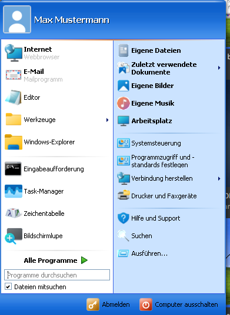
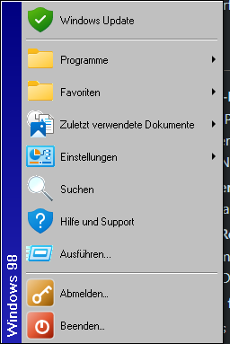
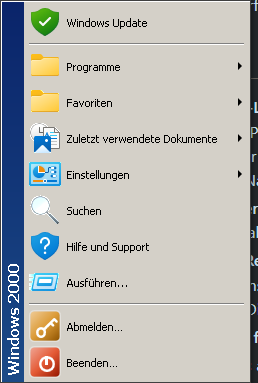
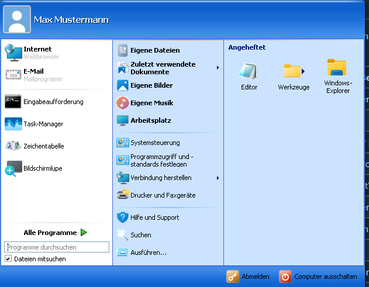
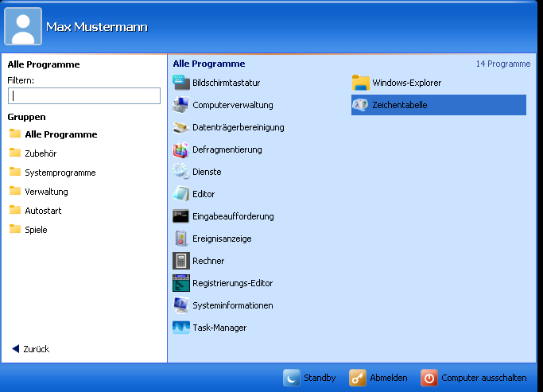
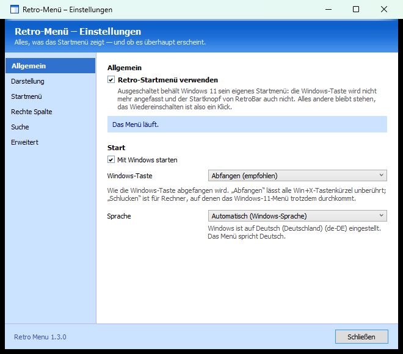

# retro-menu-win11

Ein Startmenü im Stil älterer Windows-Versionen für Windows 11 – das Gegenstück zu
[RetroBar](https://github.com/dremin/RetroBar), das dasselbe mit der Taskleiste macht.

RetroBar ersetzt die Taskleiste, lässt aber das moderne Windows-11-Startmenü stehen.
Genau diese Lücke schließt dieses Projekt: Die Windows-Taste (und der Start-Knopf von
RetroBar) öffnen ab jetzt ein klassisches Menü statt der Kacheloberfläche.



## Installation

Die fertigen Dateien liegen unter [Releases](https://github.com/glappa/retro-menu-win11/releases).

| Datei | Für wen |
| --- | --- |
| `RetroMenu-Setup-x64.exe` | Der übliche Weg. Bringt alles mit, setzt nichts voraus. |
| `RetroMenu-portable-x64.zip` | Wer nichts installieren möchte. Braucht das [.NET 8 Desktop Runtime](https://dotnet.microsoft.com/download/dotnet/8.0). |

Zu jeder Ausgabe stehen die **SHA-256-Prüfsummen** in den Anmerkungen und in
`SHA256SUMS.txt`. Nachrechnen lässt sich das mit:

```bash
powershell -Command "Get-FileHash .\RetroMenu-Setup-x64.exe -Algorithm SHA256"
```

Der Assistent legt das Programm in **Ihren eigenen Benutzerordner**
(`%LocalAppData%\Programs\RetroMenu`). Keine Administratorrechte, keine Änderung am
System. Mit dabei ist **Retro Menu Einstellungen** – ein eigenes Programm mit eigener
Verknüpfung im Startmenü, siehe [Einstellungen](#einstellungen).

Auf Wunsch richtet der Assistent **RetroBar gleich mit ein** – geladen wird dabei das
Portable-Archiv direkt von dessen Releases, und die Prüfsumme des Downloads steht
anschließend im Protokoll des Assistenten. Entfernen geht über die Programmliste von
Windows.

Selber bauen:

```bash
dotnet build src/RetroMenu/RetroMenu.csproj -c Release
```

```bash
powershell -ExecutionPolicy Bypass -File release.ps1
```

## Zwei Menüs, je nach Epoche

Das Startmenü hat sich zwischen Windows Me und Windows XP grundlegend geändert, und
beide Formen sind hier nachgebaut – nicht nur andere Farben, sondern der jeweils
richtige Aufbau.

| | |
| --- | --- |
|  |  |

Und auf Wunsch mit dem Kachelbereich für die Favoriten:



Und „Alle Programme", das sich das ganze Menü nimmt statt danebenzuklappen:



**Eine Spalte mit senkrechtem Banner** (Windows 95, 98, Me, 2000): Windows Update,
Programme ▸, Favoriten ▸, Zuletzt verwendete Dokumente ▸, Einstellungen ▸, Suchen,
Hilfe, Ausführen…, dann Abmelden… und Beenden… Der Streifen am linken Rand trägt den
Versionsnamen von unten nach oben.

**Zwei Spalten mit Kopf und Fuß** (Windows XP in vier Farben): links die beiden
Sonderplätze „Internet" und „E-Mail" samt Standardprogramm, darunter Angeheftetes und
häufig Verwendetes, rechts die Systemorte, unten Abmelden und Ausschalten.

## Was drin ist

* **Nachgemessene Maße statt Nachempfinden.** Für XP: 384 Pixel breit, zwei Spalten zu
  je 190, Kopf 54, Fuß 36, Zeilen 34 bzw. 26, Tahoma 11 – dazu die dreizehn Farbstufen
  des Kopf-Verlaufs, die orange Haarlinie darunter und die flache Auswahlfarbe
  `#2F71CD`. Für die 9x-Familie das 3D-System­grau der Zeit und ein Banner in vollem
  `#000080`, abgenommen von der Originalgrafik.
* **Systemweite Suche im Stil der Windows-11-Suche**: gruppiert in *Beste
  Übereinstimmung / Apps / Einstellungen / Dateien*. Sie findet alle Programme des
  Rechners (App-Paths-Registry, Uninstall-Einträge, Installationsordner), die
  Windows-Einstellungen und – per Häkchen – Dateien über den Windows-Suchindex.
  Anfangsbuchstaben zählen mit, „vsc" findet also Visual Studio Code.
* **Die Lupe öffnet eine eigene Suchansicht**, statt die Explorer-Suche zu starten:
  die Spalten treten beiseite und das ganze Menü wird zur Suche – links die
  Kriterien, rechts die Treffer mit vollem Pfad, so wie XP seine Suche aufteilte.
  Einschränken lässt sich nach Kategorie (Apps, Einstellungen, Dateien), Art
  (Dokumente, Bilder, Musik, Videos, Ordner), Ort und Änderungsdatum. Die Ortsliste
  holt ihre Namen von Windows selbst, ist also immer in der richtigen Sprache.
  Escape oder „Zurück" führt ins normale Menü, das Menü bleibt dabei gleich hoch
  und wird nur breiter. Die einspaltigen 9x/2000-Auslagen haben dafür keinen Platz
  und reichen weiter an die Windows-Suche.
* **Scrollleisten im Stil der jeweiligen Epoche.** Eine Vorlage, vom Design
  eingekleidet: XP bekommt den Luna-Verlauf mit abgerundeten Ecken und Haarlinie,
  die 9x-Familie den eckigen 3D-Rahmen über dem gerasterten Schacht — beide
  17 Pixel breit wie damals. Das Mausrad rollt drei ganze Zeilen weiter, statt drei
  Textzeilen, sodass keine Zeile halb angeschnitten stehen bleibt.
* **Die Suchansicht durchsucht wirklich den Rechner.** Der Windows-Index kennt nur,
  was Windows indizieren soll – im Wesentlichen das Benutzerprofil. Deshalb läuft
  zusätzlich eine eigene Suche über die Platte, die dort anfängt, wo Programme
  wohnen: Steam-Bibliotheken (aus `libraryfolders.vdf` gelesen, auch auf anderen
  Laufwerken), Programme, Programme (x86), das Profil, dann die übrigen Festplatten.
  Sie geht in die Breite, überspringt Systeminnereien und Verknüpfungspunkte, meldet
  Treffer im Sekundentakt und gibt nach zehn Sekunden auf, statt zum Vollscan zu
  werden. So findet die Suche auch `cs2.exe` in einer Steam-Bibliothek, die im Index
  nicht auftaucht.
* **Verbindungen ▸** wie in XP, nur mit dem, was heute dazugehört. Oben die
  Wege nach draußen, für die Windows den Client selbst mitbringt:
  Remotedesktop, **SSH** und **SFTP** (das OpenSSH aus dem System32-Ordner),
  **Telnet** — nur wenn das optionale Feature eingeschaltet ist, sonst fehlt der
  Eintrag —, **FTP** und **Netzwerkordner öffnen**, beide als Ordner im
  Explorer, dazu **Linux (WSL)** mit den installierten Systemen als Kaskade
  und das Netzlaufwerk-Fenster der Shell. Ein kleiner Dialog im Luna-Anstrich
  fragt vorher nach Ziel, Port und — bei SSH und SFTP — nach dem Schlüssel aus
  dem eigenen .ssh-Ordner.

  Darunter stehen die Netzwerkverbindungen des Rechners selbst. Ein Klick auf
  eine Verbindung zeigt ihren Status, wie der Doppelklick im Ordner. Die
  Einträge tragen alle dieselbe Kennung, darum wird die PIDL im Ordner gesucht
  und gezielt der kanonische Verb `status` ausgeführt – nicht der sichtbare
  Text, den es in 24 Sprachen zu raten gäbe, und nicht der Standardbefehl, der
  auch „Deaktivieren" heißen kann.
* **Das Verbindungsfenster im Luna-Anstrich.** Keiner dieser Clients hat eine
  Oberfläche, also haben sie hier eine: blaue Titelleiste mit rotem Schließknopf,
  der sandfarbene Dialoghintergrund `#ECE9D8`, XP-Knöpfe und ein XP-Auswahlfeld.
  Darin stehen Ziel und Port, bei SSH und SFTP dazu die **Schlüsselauswahl** — die
  Schlüssel aus `~/.ssh` stehen zur Wahl, dazu ein Dateiauswahl-Knopf; ohne
  Schlüssel fragt ssh wie gewohnt nach dem Kennwort. Die Konsolenclients starten in
  einem Fenster, das offen bleibt, damit auch eine abgelehnte Verbindung lesbar
  ist; FTP und Netzwerkordner gehen an den Explorer, und zwar an ihn selbst statt
  an die Zuordnung, weil `ftp://` sonst beim Browser landet, der damit nichts mehr
  anfängt.
* **Der XP-Explorer wird geprüft, bevor er drankommt.** Ist
  windows-xp-explorer-win-11 vorhanden *und* vollständig, öffnen sich Ordner darin;
  sonst immer im Windows-Explorer. Geprüft wird, ob neben der EXE die Programmdatei
  und ihre `runtimeconfig.json` liegen — eine halb gelöschte Installation antwortet
  sonst mit einem Absturzfenster statt mit einem Ordner. Startet eine Fassung doch
  noch weg, wird sie abgeschrieben und der Ordner nachträglich im Windows-Explorer
  geöffnet. Und Orte ohne Pfad — Systemsteuerung, Drucker, Netzwerkverbindungen —
  gehen grundsätzlich an den Windows-Explorer, denn ein Dateifenster kann sie nicht
  zeigen.
* **Das echte Explorer-Kontextmenü** auf jedem Eintrag – Öffnen, Als Administrator
  ausführen, Senden an ▸, Ausschneiden, Kopieren, Löschen, Eigenschaften und alles,
  was Shell-Erweiterungen beisteuern, nur eben im Retro-Anstrich.
* **„Alle Programme" übernimmt das Menü**, statt als Kaskade danebenzuklappen:
  links die Gruppen – die Ordner beider Startmenü-Bäume und die Store-Apps – und
  ein Feld zum Filtern, rechts die Programme in so vielen Spalten, wie der
  Bildschirm hergibt. Sie laufen eine Spalte hinunter und in der nächsten weiter,
  wie der Satz einer Zeitung, damit eine alphabetische Liste alphabetisch bleibt.
  Eine Kaskade ist einen Eintrag breit, gleich wie viele Programme darin stehen;
  bei ein paar hundert war das eine Wand aus Untermenüs. Esc räumt erst den
  Filter weg, dann die Ansicht, dann das Menü. Als Kaskade gibt es die Programme
  weiterhin unter „Programme ▸" in der rechten Spalte.
* **Favoriten mit Ordnern.** Rechtsklick auf einen Eintrag legt ihn oben in die
  Favoritenliste. Von dort lässt er sich in einen Ordner verschieben – die
  Gruppierung des Windows-11-Menüs. Ordner lassen sich umbenennen und auflösen, und
  ein Ordner klappt beim Draufzeigen als Kaskade auf.
* **Angeheftetes per Ziehen ordnen.** Ein angehefteter Eintrag auf einen anderen
  gezogen macht aus beiden einen Ordner – die Geste des Windows-11-Menüs, ohne
  Nachfrage; umbenennen lässt er sich danach. Auf einen Ordner gezogen wandert er
  hinein, an den Rand eines Nachbarn gezogen schiebt er sich dazwischen. Eine Linie
  oder ein Rahmen zeigt vorher, wo er landet.
* **Wahlweise als Kachelbereich.** Ein Häkchen setzt die Favoriten stattdessen in
  einen dritten Bereich rechts neben das Menü: Programme und Ordner als Raster, wie
  das Angeheftet-Feld von Windows 11, nur im Anstrich der jeweiligen Epoche. Ordner
  tragen dort einen Pfeil, zeigen die ersten vier Symbole ihres Inhalts und klappen
  genauso auf.
* **Häufig oder zuletzt verwendet.** Die untere Liste zeigt wahlweise die am
  häufigsten oder die zuletzt gestarteten Programme (Einstellungen →
  „Zuletzt gestartete Programme zeigen"). Nach XP-Regeln bleiben Installer,
  Deinstallationsprogramme und Systemwerkzeuge draußen; ein Programm kann sich per
  `NoStartPage` heraushalten. Neu installierte Programme werden hervorgehoben.
* **Windows+S gehört ebenfalls dem Menü.** Die Kombination öffnet es mit dem Zeiger im
  Suchfeld, statt die Windows-11-Suche aufzuklappen. Windows+Shift+S bleibt der
  Screenshot.
* **Auto-Hide-Taskleiste fährt mit hoch**, solange das Menü offen ist.
* **Tastatur**: Pfeiltasten durch beide Spalten, Buchstaben springen, Eingabe startet.
* **Ein eigenes Einstellungsprogramm**, das mitinstalliert wird: Design, Größe,
  Sprache, Verhalten der Windows-Taste, welche Einträge das Menü überhaupt zeigt —
  und ganz oben der Schalter, der das Retro-Menü ab- und wieder anschaltet, ohne
  etwas zu verlieren. Es läuft für sich, auch wenn das Menü gerade aus ist.
* **Spricht die Sprache des Windows, auf dem es landet.** Gefragt wird die
  Anzeigesprache selbst (`GetUserPreferredUILanguages`, also die Liste aus
  „Zeit und Sprache" in der Reihenfolge des Benutzers) — 24 Sprachen sind
  übersetzt, der Rest bekommt Englisch. Der Einrichtungs-Assistent spricht sie
  ebenfalls schon.

## Bedienung

| Aktion | Wirkung |
| --- | --- |
| Windows-Taste | Menü auf/zu |
| Windows+S | Menü auf, Zeiger gleich im Suchfeld |
| Start-Knopf in RetroBar | Menü auf/zu |
| Klick auf das Tray-Symbol | Menü auf |
| Rechtsklick aufs Tray-Symbol | Menü ein/aus, Einstellungen, Programmliste neu einlesen, Beenden |
| Esc | Menü zu |
| Tippen | sucht in Programmen, Einstellungen und auf Wunsch Dateien |
| Rechtsklick auf einen Eintrag | Favoriten, Ordner und das volle Explorer-Menü |
| Zeigen auf einen Favoritenordner | klappt ihn auf |
| Angeheftetes ziehen | umsortieren, in einen Ordner legen, zu einem Ordner zusammenlegen |
| „Alle Programme" | öffnet die Programme im ganzen Menü, Esc führt zurück |
| Umschalt + Rechtsklick | dazu die erweiterten Befehle |
| Zeigen auf ▸-Einträge | klappt das Untermenü auf |
| Pfeiltasten / Buchstaben / Eingabe | Bedienung ohne Maus |
| Klick auf das Benutzerbild | Benutzerkonten |

Alle Kombinationen mit der Windows-Taste (Win+E, Win+R, Win+D, Win+L …) funktionieren
unverändert weiter.

## Wie das Abfangen der Windows-Taste funktioniert

Windows öffnet sein Startmenü beim **Loslassen** der Windows-Taste – aber nur, wenn
zwischendurch keine andere Taste gedrückt wurde. Das Programm hängt sich mit einem
`WH_KEYBOARD_LL`-Hook in den Tastaturstrom und schiebt bei einem einzelnen Tippen kurz
vor dem Loslassen eine unbelegte Taste ein. Für Windows sieht das wie eine
Tastenkombination aus, sein eigenes Menü bleibt zu – und wir zeigen unseres.

Weil ein solcher Hook auch simulierte Eingaben sieht, funktioniert der Start-Knopf von
RetroBar ohne jede Anpassung mit: RetroBar ruft dafür `ShellHelper.ShowStartMenu()` aus
ManagedShell auf, und das simuliert genau so einen einzelnen Windows-Tastendruck.

Falls das auf einem Rechner nicht greift, gibt es in den Einstellungen zwei Alternativen:

| Modus | Verhalten |
| --- | --- |
| **Abfangen** (Standard) | Windows-Taste läuft durch, wird nur neutralisiert |
| **Vollständig schlucken** | Taste wird abgefangen und nur bei echten Kombinationen wieder eingespeist |
| **Nicht anfassen** | Hook aus; das Menü geht dann nur über Tray-Symbol und RetroBar |

### Windows+S

Derselbe Hook nimmt der Windows-11-Suche **Windows+S** ab und öffnet stattdessen das
Menü mit dem Zeiger im eigenen Suchfeld. Das S wird ganz geschluckt, damit die Suche von
Windows gar nicht erst anspringt; weil damit aber auch die Windows-Taste wieder allein
dastünde, geht die unbelegte Taste von oben mit hinterher – sonst käme statt der Suche
das Windows-11-Startmenü.

Zwei Dinge sind dabei Absicht:

* **Windows+Shift+S** (Screenshot) und **Windows+Strg+S** bleiben unangetastet; genommen
  wird nur die Kombination ohne weitere Zusatztaste.
* Es gilt **auch bei „Nicht anfassen"** – dass die Windows-Taste in Ruhe gelassen wird,
  ist ein Versprechen über die Taste allein, nicht über diese Kombination. Abschalten
  lässt sich das in den Einstellungen unter *Erweitert → Tastenkürzel*.

Ist das Suchfeld ausgeschaltet, öffnet Windows+S stattdessen die große Suchansicht; in
den 9x-Menüs, die nie ein Suchfeld hatten, das Suchfenster jener Zeit.

## Die Taskleiste kommt mit hoch

Läuft RetroBar mit automatischem Ausblenden, fährt die Leiste beim Öffnen des Menüs
wieder heraus und bleibt stehen, bis das Menü zugeht.

Erreicht wird das ohne einen einzigen Eingriff in RetroBar: RetroBar sucht zehnmal
pro Sekunde nach einem offenen Startmenü und erkennt dabei neben dem modernen Menü
auch fremde — unter anderem an der Fensterklasse `OpenShell.CMenuContainer`. Solange
unser Menü offen ist, halten wir ein leeres, vollständig durchsichtiges und
klickdurchlässiges Fenster dieser Klasse über der Menüfläche.

## Und die Ordner dazu

Ordner, die aus dem Menü heraus aufgehen – „Eigene Dateien", „Arbeitsplatz", „Zuletzt
verwendete Dokumente" –, landen sonst im Windows-11-Explorer, und der passt zu nichts
hier. Ist [windows-xp-explorer-win-11](https://github.com/glappa/windows-xp-explorer-win-11)
installiert, öffnet das Menü sie stattdessen dort: Aufgabenbereich, grüne Pfeile,
Statusleiste, alles im gleichen Anstrich wie Leiste und Menü.

Gesucht wird neben dem Menü selbst, unter `%LocalAppData%\Programs\XpExplorer` und an
den üblichen anderen Stellen; gefunden oder nicht, steht in den Einstellungen. Wer
lieber beim gewohnten Explorer bleibt, nimmt dort **„Ordner im XP-Dateifenster
öffnen"** heraus. Was das Dateifenster nicht zeigen kann – die Systemsteuerung etwa –,
reicht es von sich aus an Windows weiter.

## Designs

| Design | Aufbau | RetroBar-Designs, die darauf abgebildet werden |
| --- | --- | --- |
| Windows 95 | eine Spalte | – |
| Windows 98 | eine Spalte | Windows 95-98 |
| Windows Me | eine Spalte | Windows Me |
| Windows 2000 | eine Spalte | Windows 2000, XP Classic, Vista Classic, System |
| Windows XP Blue | zwei Spalten | XP Blue, XP Embedded Style, Vista Basic, System XP/Vista |
| Windows XP Olive Green | zwei Spalten | Windows XP Olive Green |
| Windows XP Silver | zwei Spalten | Windows XP Silver |
| Windows XP Royale | zwei Spalten | XP Royale, Royale Noir, Zune Style, Watercolor, Longhorn/Vista Aero |

Ist **„Design von RetroBar übernehmen"** aktiv (Standard), liest das Menü RetroBars
`settings.json` mit und wechselt das Design automatisch mit. Geschrieben wird in
RetroBars Dateien nie. Übernommen wird von dort außerdem die Kantenglättung der
Schrift und – einmalig beim ersten Start – die Quick-Launch-Reihenfolge als
Startbelegung der angehefteten Programme. Die Sprache kommt normalerweise von
Windows; wer lieber RetroBar folgen möchte, stellt in den Einstellungen
**Automatisch (RetroBar)** ein.

## Sprachen

Standardmäßig richtet sich das Menü nach der **Anzeigesprache von Windows**. Gefragt
wird `GetUserPreferredUILanguages` — die Liste aus „Zeit und Sprache" in der
Reihenfolge, die der Benutzer selbst gesetzt hat; erst wenn die nichts hergibt,
kommen `GetUserDefaultUILanguage` und die Kultur des Prozesses als Notnagel.
Regionen fallen auf ihre Sprache zurück (`de-CH` → Deutsch, `fr-CA` → Französisch),
Chinesisch wird nach Schrift getrennt (`zh-CN`/`zh-SG` → vereinfacht,
`zh-TW`/`zh-HK`/`zh-MO` → traditionell), und brasilianisches Portugiesisch hat eine
eigene Tabelle.

In der Sprachliste der Einstellungen stehen oben zwei Automatiken —
**Automatisch (Windows-Sprache)** und **Automatisch (RetroBar)** — darunter jede
Sprache unter ihrem eigenen Namen. Die Zeile darunter sagt, was Windows gemeldet
hat und was daraus geworden ist.

Übersetzt sind: Deutsch, English, Čeština, Dansk, Español, Français, Italiano,
Magyar, Nederlands, Norsk bokmål, Polski, Português, Português (Brasil), Română,
Suomi, Svenska, Türkçe, Ελληνικά, Русский, Українська, 日本語, 한국어, 简体中文,
繁體中文. Alles andere — darunter die von rechts nach links geschriebenen Sprachen,
für die das Layout noch nicht gespiegelt wird — bekommt Englisch.

Eine Sprache dazuzunehmen ist eine Datei: `src/RetroMenu/Services/Strings/Xx.cs`
nach dem Vorbild von `En.cs` anlegen und eine Zeile in `Lang.Languages` ergänzen.
Fehlt darin ein Schlüssel, springt automatisch Englisch ein.

## Einstellungen

Die Einstellungen sind ein **eigenes Programm**: `RetroMenuSettings.exe`, mit eigener
Verknüpfung im Startmenü („Retro Menu Einstellungen") und auch über das Tray-Symbol
des Menüs erreichbar. Es läuft für sich, ganz gleich ob das Menü gerade läuft –
denn der Schalter, mit dem man es wieder einschaltet, wohnt darin.



Ganz oben steht der **Hauptschalter**: *Retro-Startmenü verwenden*. Ausgeschaltet
behält Windows 11 sein eigenes Startmenü – die Windows-Taste wird nicht mehr
angefasst, der Startknopf von RetroBar auch nicht. Alles andere bleibt stehen, das
Wiedereinschalten ist also ein Klick, und angeheftete Programme gehen dabei nicht
verloren.

Sechs Seiten:

| Seite | Was dort steht |
| --- | --- |
| **Allgemein** | Hauptschalter, ob das Menü läuft, Autostart, Windows-Taste, Sprache |
| **Darstellung** | Design und RetroBar folgen, Menügröße, Kontobild, angezeigter Name, Menüklang |
| **Startmenü** | Angeheftete Programme ein/aus, Kachelbereich, Internet- und E-Mail-Platz, Anzahl der häufig verwendeten, „Alle Programme", Liste der verwendeten Programme leeren |
| **Rechte Spalte** | Jeder Eintrag einzeln an- und abwählbar, wie in XPs „Startmenü anpassen" |
| **Suche** | Suchfeld, Dateisuche, Store-Apps |
| **Erweitert** | Windows+S abfangen, Taskleiste einblenden, „Als Administrator ausführen", XP-Dateifenster, Einstellungsdatei sichern/laden/zurücksetzen, Protokoll |

Es gibt **keinen OK-Knopf**: jede Änderung wird sofort geschrieben, und das laufende
Menü baut sich neu auf, ohne Neustart. Technisch schreibt das Einstellungsprogramm die
Datei und setzt ein benanntes Ereignis (`Local\RetroMenuWin11.Reload`); das Menü liest
daraufhin neu. Dabei werden nur die Schalter übernommen – angeheftete Programme und
Startzähler stehen weiter unter der Hoheit des Menüs und werden nicht überschrieben,
selbst wenn während des Einstellens etwas angeheftet wird.

Beide Programme sind **dieselbe Datei**: der Assistent legt `RetroMenuSettings.exe` als
harte Verknüpfung neben `RetroMenu.exe`. Das kostet keinen zweiten Satz .NET-Laufzeit
auf der Platte, und trotzdem ist es ein eigenes Programm mit eigenem Prozess und
eigenem Eintrag im Startmenü. Wo harte Verknüpfungen nicht gehen, wird kopiert. Ohne
Installation tut es `RetroMenu.exe --settings`.

Alles landet in `%AppData%\RetroMenuWin11\settings.json`:

| Schlüssel | Bedeutung |
| --- | --- |
| `Enabled` | Der Hauptschalter. `false` heißt: Windows 11 zeigt sein eigenes Startmenü |
| `Theme`, `FollowRetroBarTheme` | Design, bzw. RetroBar folgen |
| `UseXpExplorer`, `XpExplorerPath` | Ordner im XP-Dateifenster öffnen, und wo es liegt |
| `Language` | `auto` (folgt Windows), `auto-retrobar` (folgt RetroBar) oder ein fester Code wie `de`, `pt-BR`, `zh-Hant` |
| `WinKeyMode` | `Neutralize`, `Swallow` oder `Off` |
| `MenuScale` | 1.0 ist Originalgröße; auf großen Bildschirmen darf es mehr sein |
| `FrequentCount` | Wie viele „häufig verwendet"-Einträge |
| `KeepTaskbarVisible` | Auto-Hide-Taskleiste einblenden, solange das Menü offen ist |
| `ShowSearchBox`, `SearchFiles` | Suchfeld, und ob es Dateien mitsucht |
| `SearchHotkey` | Windows+S öffnet die Suche des Menüs statt der von Windows 11 |
| `ShowStoreApps`, `ShowRunAsAdmin`, `PlaySounds` | Ein/aus |
| `ShowRecentPrograms` | Untere Liste nach Zeit statt nach Häufigkeit |
| `ShowFavourites` | Angeheftete Programme überhaupt anzeigen |
| `ShowTilePanel` | Favoriten als Kachelbereich rechts statt als Liste links |
| `ShowDefaultAppSlots` | Internet- und E-Mail-Platz oben in der linken Spalte |
| `ShowAllProgramsButton` | Die Schaltfläche „Alle Programme" |
| `ShowUserPicture` | Kontobild in der blauen Kopfzeile |
| `HiddenPlaces` | Abgewählte Einträge der rechten Spalte, z. B. `["Run", "Help"]` |
| `Favourites` | Favoriten, samt Ordnern und deren Inhalt |
| `LaunchCounts`, `LaunchTimes`, `KnownPrograms` | Startzähler, Startzeiten, bekannte Programme |
| `UserName` | Überschreibt den angezeigten Namen |

Daneben liegt `retromenu.log`. Mit `RETROMENU_DEBUG=1` kommt jedes Ereignis der
Windows-Taste dazu. `RetroMenu.exe --dumpmenu <Datei>` schreibt das Shell-Kontextmenü
einer Datei ins Protokoll, `--demo` füllt das Menü mit Platzhaltern für Screenshots,
`--settings` öffnet die Einstellungen, `--quit` beendet eine laufende Ausführung sauber.

## Woher die Details stammen

Der Quellcode von Windows ist nicht öffentlich, und das, was 2020 in Umlauf kam, ist
geleakter Microsoft-Code – daraus ist hier nichts abgeschrieben. Stattdessen:

* **Aussehen**: an originalgetreuen Nachbildungen Pixel für Pixel abgemessen – die
  XP-Werte an einer HTML-Nachbildung des Luna-Menüs, das 9x-Banner an der
  Originalgrafik einer Windows-98-Nachbildung.
* **Verhalten**: über die dokumentierten Windows-Schnittstellen nachgebaut –
  `IContextMenu` für das Kontextmenü, `AssocQueryString` für die Standardprogramme,
  `IShellItemImageFactory` für die Symbole, `Search.CollatorDSO` für die Dateisuche,
  `WH_KEYBOARD_LL` für die Windows-Taste.
* **Regeln** wie die Ausschlussliste von „häufig verwendet" aus dem beobachtbaren
  Verhalten und den dokumentierten Registry-Schaltern (`NoStartPage`).

Die Symbole sind die von Windows 11. Ein Menü in alten Maßen mit heutigen Symbolen ist
der ehrlichste Kompromiss: die Originalsymbole gehören Microsoft und liegen deshalb
nicht in diesem Repository. Die drei kleinen Bilder unten im XP-Menü – der grüne Pfeil,
der Schlüssel und der Ausschalter – sind als Vektor nachgezeichnet.

## Bekannte Grenzen

* Über Fenstern, die **als Administrator** laufen, sieht ein normaler Tastatur-Hook
  nichts. Wer das Menü auch dort per Windows-Taste braucht, muss RetroMenu selbst
  erhöht starten.
* Windows 11 liefert für „Arbeitsplatz" über jede Icon-API nur ein
  Standard-Ordnersymbol. Solche Symbole holt das Menü direkt aus `imageres.dll`.
* Die Dateisuche fragt den Windows-Suchindex. Ist der Dienst aus oder ein Ordner nicht
  indiziert, findet sie dort nichts und sagt das auch.
* Olive, Silber und Royale entstehen aus den gemessenen blauen XP-Werten per
  Farbtonverschiebung; nachgemessen ist bisher nur Blau.

## Fahrplan

* Vista und Windows 7 – die brauchen wieder einen eigenen Aufbau (Benutzerbild oben
  rechts, „Alle Programme" als Baum in der linken Spalte selbst)
* Sprachen von rechts nach links (Arabisch, Hebräisch) — dafür muss das Layout
  gespiegelt werden, nicht nur die Wörter getauscht

## Danke

An [dremin](https://github.com/dremin) für RetroBar und ManagedShell – ohne die
Vorarbeit gäbe es hier nichts anzuschließen.

## Lizenz

MIT, siehe [LICENSE](LICENSE).

---

### English, briefly

A start menu in the style of older Windows versions for Windows 11, built as the
companion to [RetroBar](https://github.com/dremin/RetroBar). Two genuine layouts, not
just recoloured: the single column with the version name down a side strip for Windows
95 through 2000, and the two column panel with header and footer for Windows XP. Sizes,
gradients and colours are measured off faithful recreations rather than approximated.

A low-level keyboard hook turns a lone Windows-key press into the menu while every
Win+X shortcut keeps working, and because such a hook also sees simulated input,
RetroBar's own Start button opens it too without any patching. An auto-hidden RetroBar
taskbar rises while the menu is open. Search covers every program on the machine,
Windows settings and optionally files through the Windows Search index, grouped the way
Windows 11 presents them. Right-clicking an entry gives the real Explorer context menu.

The same hook takes **Windows+S** away from the Windows 11 search and opens the menu
with the cursor in its own search box instead. Windows+Shift+S stays the screenshot, and
the shortcut can be switched off under Advanced.

A separate settings program, `RetroMenuSettings.exe`, is installed alongside and gets
its own Start menu entry. It runs on its own whether or not the menu does, because the
master switch at the top of it — *use the retro start menu* — is what hands the start
menu back to Windows 11, and has to keep working once it has. Everything else is kept,
so switching back is one click. There is no OK button: each change is written at once
and the running menu rebuilds itself.

Grab `RetroMenu-Setup-x64.exe` from the releases page; SHA-256 checksums are in the
release notes. It installs into your own user folder, needs no administrator, and can
set up RetroBar alongside it.
